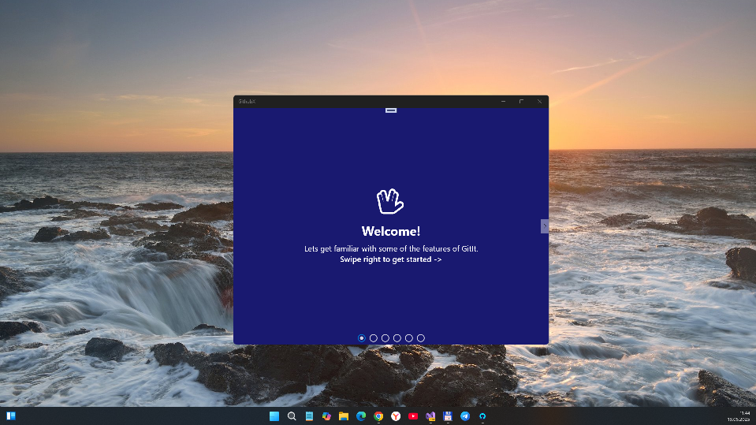
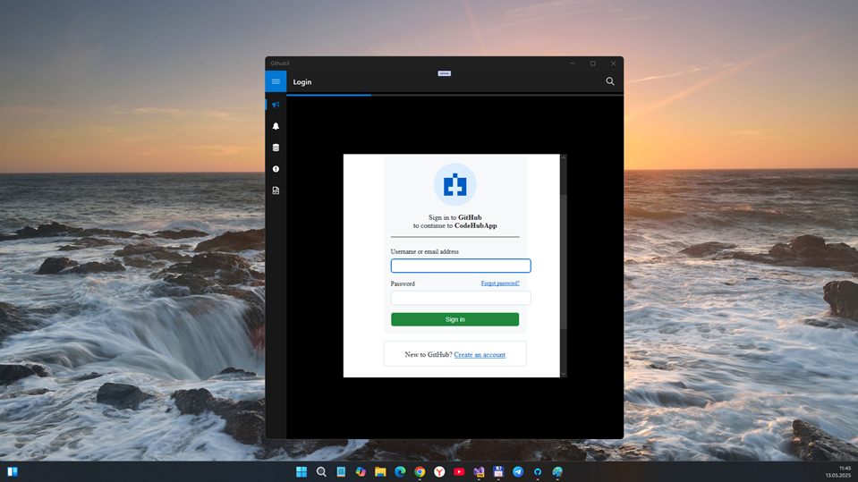
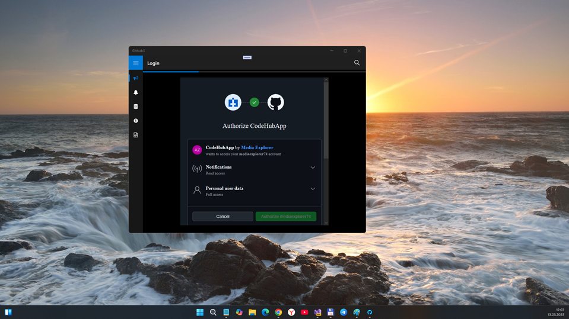

# GithubX 2.1-alpha - master branch

Some Remake ((GithubX2 codename))of old sweet GitIt project... This is my second attempt after 4-5 years, yea!  I decided to port that "old sweetie" from obsolete portable to normal multiplatform one (targets are UWP and, mabe, Android). 

## About R&D
GithubX planned as re-dev (2nd attempt to dev) some simplest retro-client for Windows 10 Mobile retro-os. The point of interest (research): I remembered that 5 years ago GitIt app successfully catches push notifications (ignoring MS "push system/servers" malfunction).. but idk how =)  

## Tech details
- Based on Xamarin multi-platform technology. 
- Targets: UWP, Android
- Min. Win. SDK (for UWP target) : 10240 (Hello, Astoria)

## Screenshots

## What's new?

### V2.1.0.0a
- "Astoria" os builds (10240) compatibility added.
- MVVMCross 5.0.3 downgraded from .NETStandard 2.0 to 1.4 for Astoria project compatibility
- View contents of any repository on Github
- Add and edit any file on Github
- See starred repositories
- See followers and following of any user
- Watch Repositories
- Mark Notifications As Read inside app

## Bugs / issues / unsolved things/problems (Not fixed / TODO)
- *Great problem* : auth obsolete .. I can't access to my repos via x64 assembly :( Maybe, change 10240 to 15063 could help... idk

## Credits
- https://github.com/prajjwaldimri/GithubXamarin Archived GitIt project 
- GitHub SDK & Microsoft's Xamarin (Forms&Native)
- MVVMCross library

## ..
AS IS. RnD only. No support. DIY.

## .
[m][e] :: Media Explorer : 2025
  

